# Learning the Inverse Kinematic with GANs and INNs (Invertible Neural Networks)

## Motivation
The calculation of inverse kinematics can be computationally expensive, since analytical solutions are often not available and numerical methods must be used instead.
These numerical algorithms can be sped up by providing an initial estimate that is close to the correct solution.
The goal of this work is to obtain the initial estimates using neural networks.
We compare two network architectures for this problem:
An invertible neural network (INN) trained on a forward kinematics dataset, and a generative adversarial network (GAN) trained on an inverse kinematics dataset.
Our approach can be seen as an extension to the work conducted by [Ardizzone et al.](https://arxiv.org/abs/1808.04730) by using more complex robot configurations and extending it to a 3D setting.

## 1. Installation using Docker
Use the following [setup.sh](setup.sh) script to clone the repo, build a docker image and start a container.
```sh
#!/bin/bash
git clone https://github.com/a-doering/tum-adlr-ss21-01.git
cd tum-adlr-ss21-01
docker build -f Dockerfile -t adlr .
# This will also activate the conda environment
docker run -ti adlr /bin/bash
```
## 2. Generate Training Data
The data is generated using rejection sampling.
This is a 2D example of a 7 degree robot arm with one prismatic and six rotational joints.
3D follows the same concept.
We create a dataset with n TCP (Tool Center Point) positions (`pos`) each with m joint configurations (`thetas`).
Forward           |  One Inverse | m Inverses
:-------------------------:|:-------------------------:|:-------------------------:
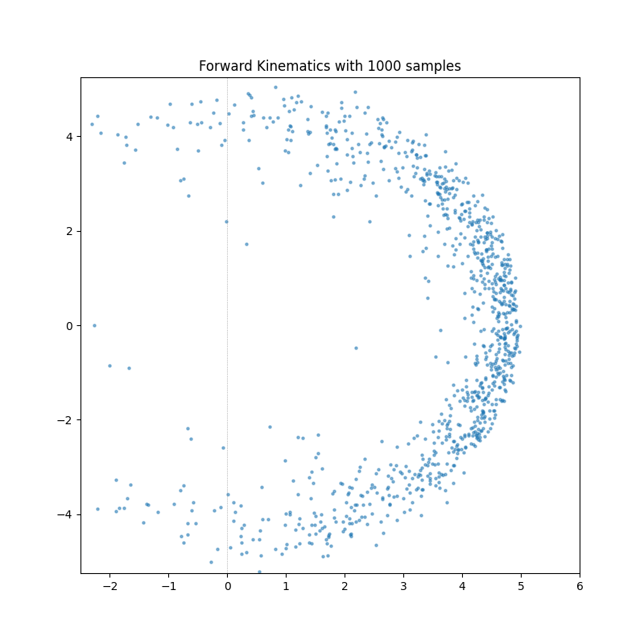|  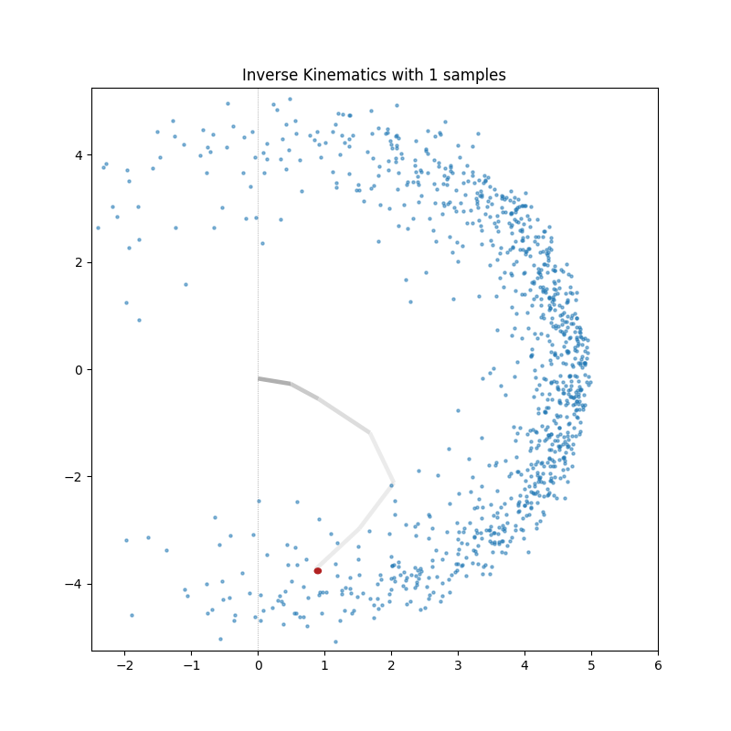| 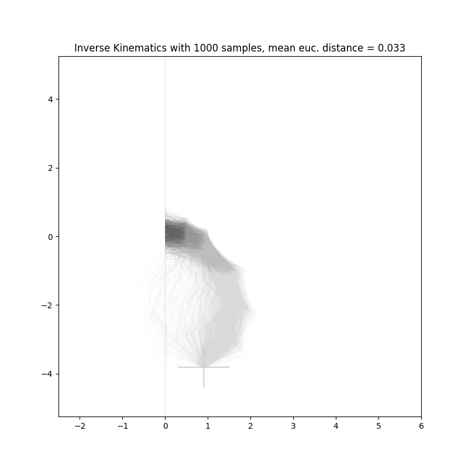
  Sample n positions | Sample configurations within epsilon ball of each position| Repeat until you have m configurations per position

Before we can train the models, we need to create training data. When chosing parameters, keep in mind that the INN needs only the forward kinematics.
```sh
# Generate 2D training data
python src/kinematics/robot_arm_2d.py
# Generate 3D training data
python src/kinematics/robot_arm_3d.py
```
## 3.1 Train a GAN
In the beginning of the training we can see mode collapse (all generated configurations are more or less the same), but then we can see how the configurations fan out.
Training 2D           |  Training 3D 
:-------------------------:|:-------------------------:
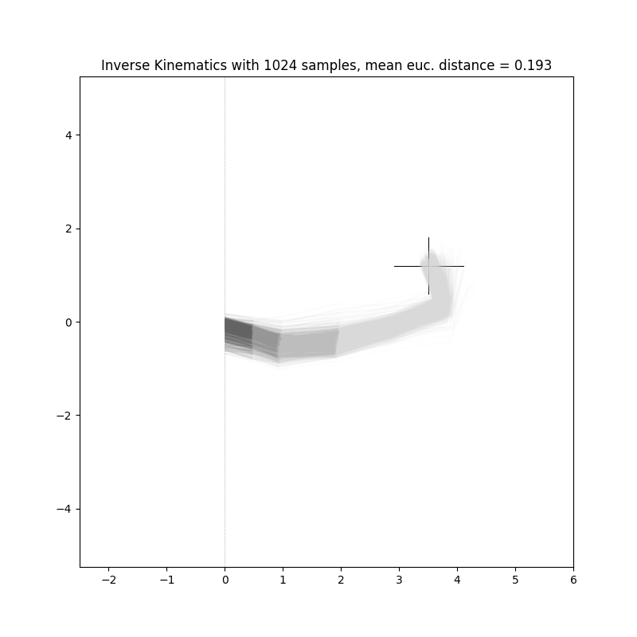 | 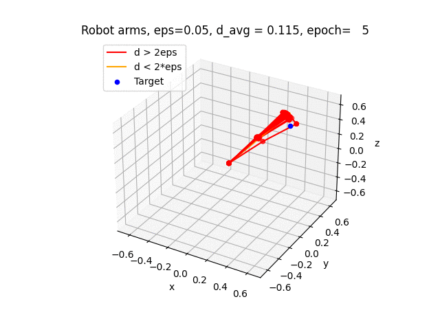
```sh
python src/kinematics/gan/train.py
python src/kinematics/gan_3d/train.py
# You can login using wandb (weights and biases) to log your training.
```
## 3.2 Train an INN
```sh
python src/inn/train.py
python src/evaluate/plot_losses.py
```
## 4.1 Evaluation/Visualization GAN
<details>
<summary> Examples 2D for a 7DOF robot.</summary>

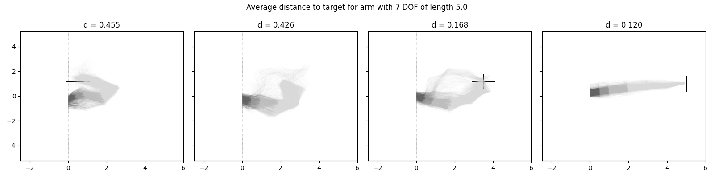    <br /><sub><b>Generated configurations for diffferent target positions</b></sub></a><br /> 
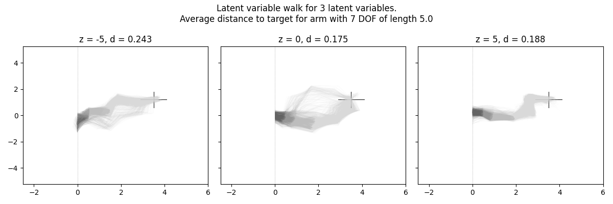    <br /><sub><b>Generated configurations for diffferent latent variables</b></sub></a><br /> 

</details>

```sh
python src/evaluate/evaluate_gan.py
```

## 4.2 Evaluation/Visualization INN
<details>
<summary> Examples 2D for a 7DOF robot.</summary>

Ground Truth Distributions           |  Predicted Distributions 
:-------------------------:|:-------------------------:
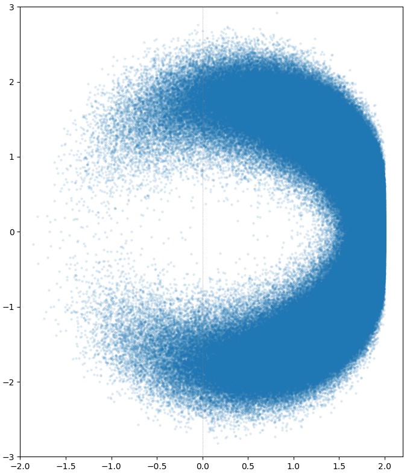    <br /><sub><b>Positions</b></sub></a><br /> | 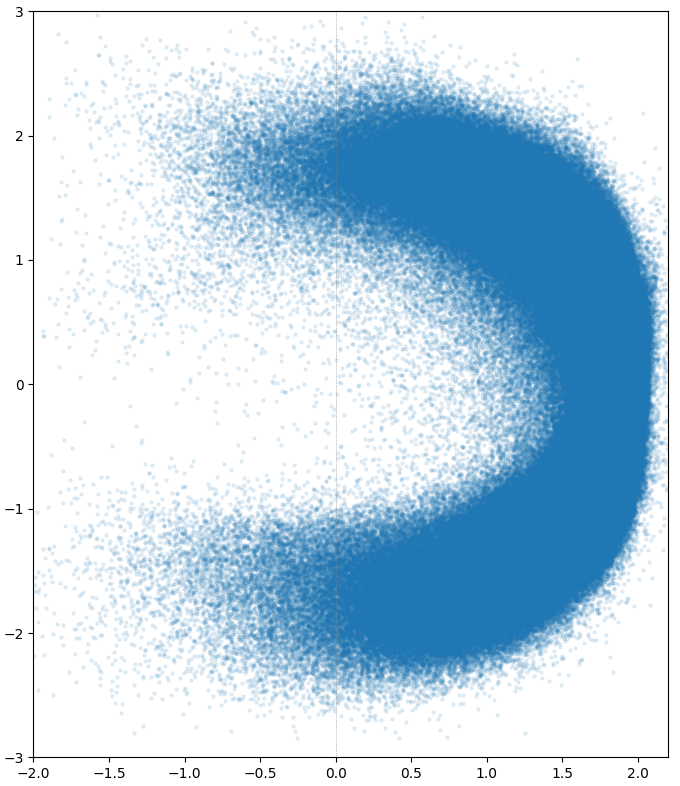 <br /><sub><b>Positions </b></sub></a><br />
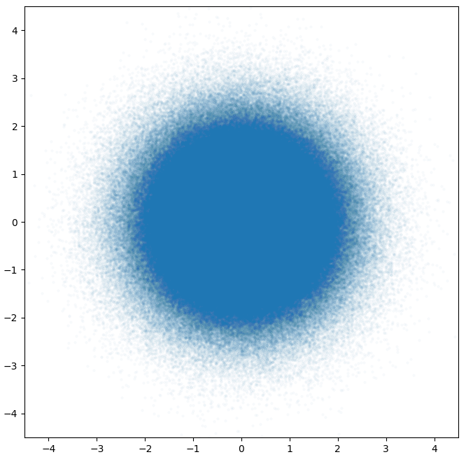    <br /><sub><b>Thetas</b></sub></a><br /> | 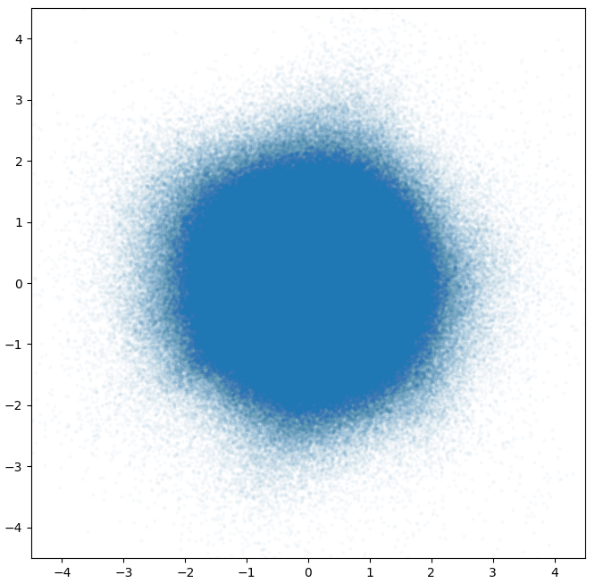 <br /><sub><b>Thetas </b></sub></a><br />

</details>


<details>
<summary> Examples 3D for a 7DOF robot.</summary>

Ground Truth Distributions           |  Predicted Distributions 
:-------------------------:|:-------------------------:
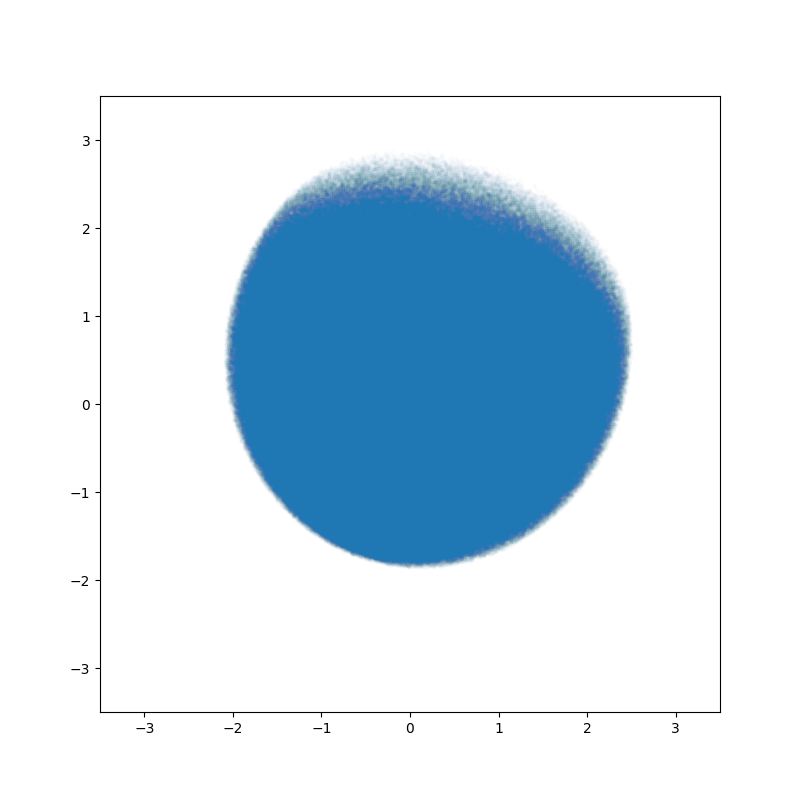    <br /><sub><b>Positions</b></sub></a><br /> | 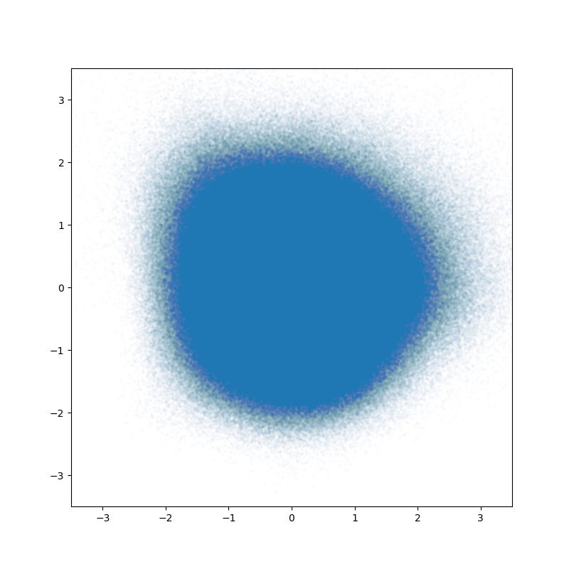 <br /><sub><b>Positions </b></sub></a><br />
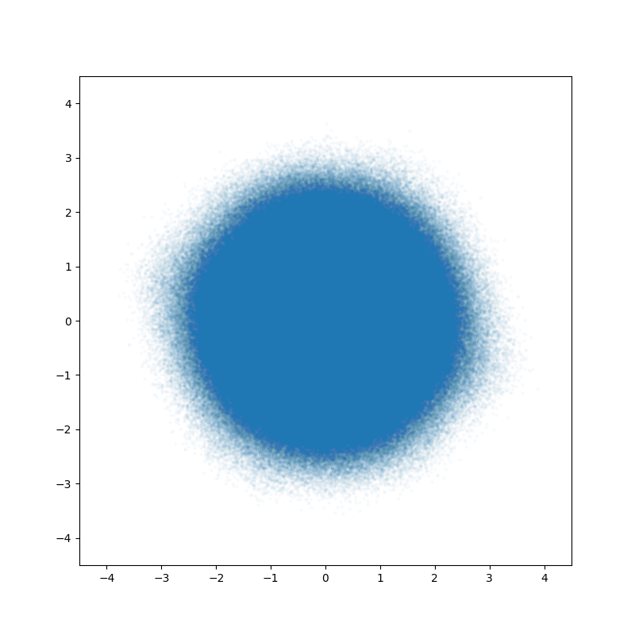    <br /><sub><b>Thetas</b></sub></a><br /> | 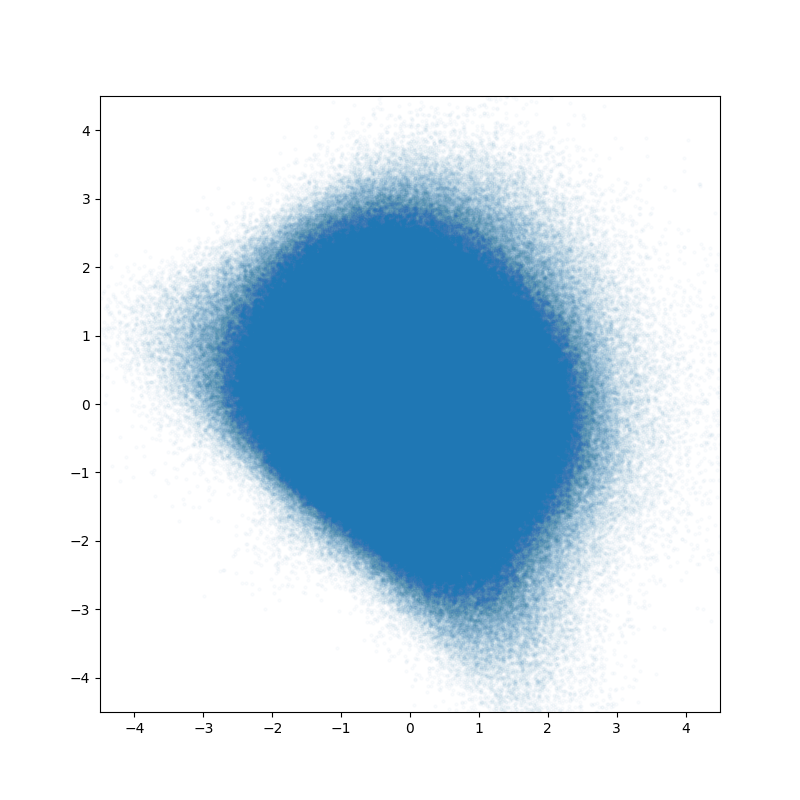 <br /><sub><b>Thetas </b></sub></a><br />

</details>

```sh
python src/evaluate/evaluate_with_mmd.py
python src/evaluate/evaluate_null_space_with_mmd.py
python src/evaluate/plot_distributions.py
```
## Contributors

<table>
  <tr>
    <td align="center"><a href="https://github.com/a-doering"><br /><sub><b> Andreas Doering </b></sub></a><br /><a href="https://github.com/a-doering/tum-adlr-ss21-01/commits?author=a-doering" title="Code">💻</a><a href="https://github.com/a-doering/tum-adlr-ss21-01/commits?author=a-doering" title="Documentation">📖</a><a href="#ideas-a-doering" title="Ideas, Planning, & Feedback">🤔</a>
   <br /><sub><b>GAN, Kinematics</b></sub></a><br />
    <td align="center"><a href="https://github.com/ArmanMielke"><br /><sub><b>Arman Mielke</b></sub></a><br /><a href="https://github.com/a-doering/tum-adlr-ss21-01/commits?author=ArmanMielke" title="Code">💻</a>
<a href="#ideas-ArmanMielke" title="Ideas, Planning, & Feedback">🤔</a>
   <br /><sub><b>INN</b></sub></a><br />
    <td align="center"><a href="https://github.com/scleronomic"><br /><sub><b> Johannes Tenhumberg</b></sub></a><br />
    <a href="https://github.com/scleronomic/rokin" title="Plugin/utility libraries">🔌</a><a href="#ideas-scleronomic" title="Ideas, Planning, & Feedback">🤔</a><a href="#mentoring-scleronomic" title="Mentoring">🔬</a>
   <br /><sub><b>Idea, Mentoring, rokin</b></sub></a><br />
  </tr>
</table>

## Acknowledgements
This work was conducted as a research project of the Advanced Deep Learning for Robotics course by professor Berthold Bäumel of the Technical Unviersity of Munich under supervison of Johannes Tenhumberg.
This project has been supported by a Google Educational Grant.