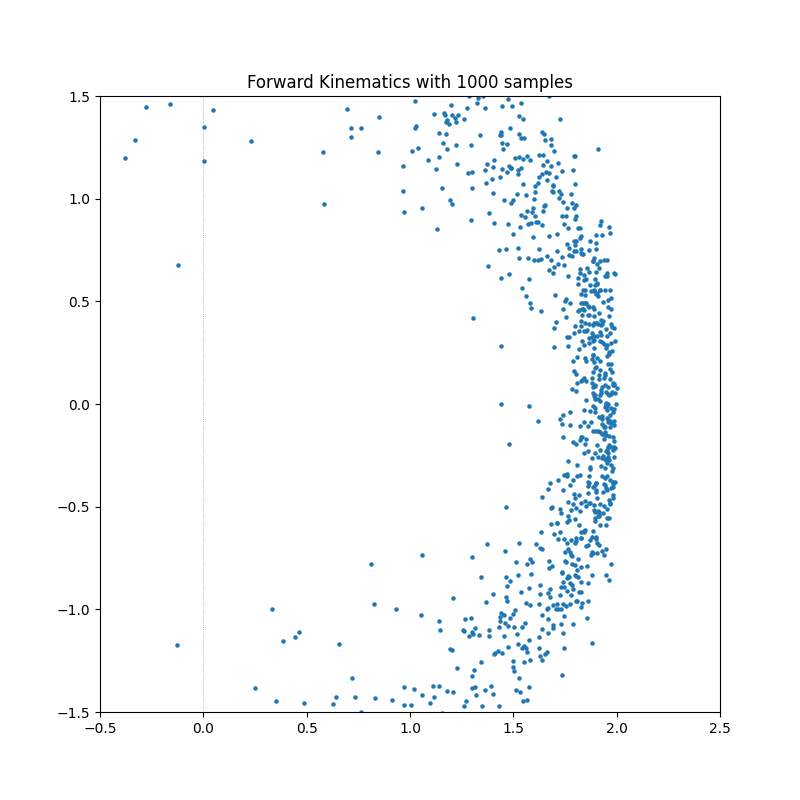
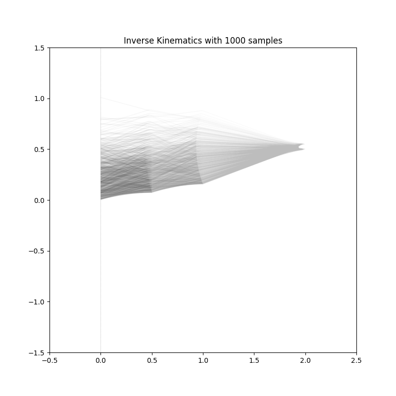
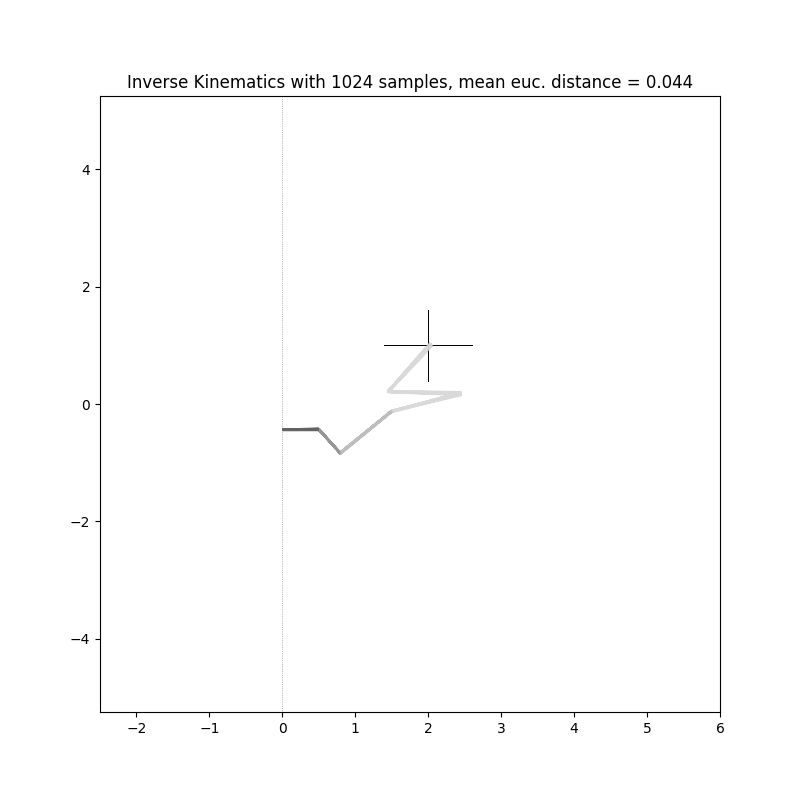
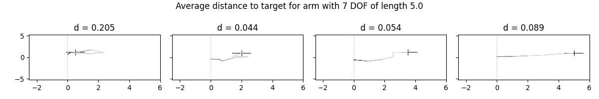

# Advanced Deep Learning for Robotics Project

## Kinematics
2D: Forward and inverse kinematics with visualization for a robot arm with at least one prismatic and multiple rotational joints. The inverse is implemented with rejection sampling.


Forward PRRR           |  Inverse PRRR
:-------------------------:|:-------------------------:
  |  

## GAN
### Conditional GAN

Training without discriminator, 7DOF           |  Training with discriminator, 7DOF 
:-------------------------:|:-------------------------:
 Mode collapse can be seen.  |  TODO

Multiple Positions, no discriminator:



## Setup

```sh
# Git setup
mkdir code
cd code
git clone https://github.com/a-doering/tum-adlr-ss21-01.git
cd tum-adlr-ss21-01
git checkout #--track origin/my_branch 

# Virtual Env Setup
python3 -m pip install virtualenv
python3 -m venv .venv
source .venv/bin/activate
pip3 install -r requirements.txt
# Currently there was an import error for freia, is not installed yet on remote, can remove with nano from requirements.txt for now

# Generate training data
python src/kinematics/robot_arm_2d_torch.py
# Train
python src/main.py
# Now login with wandb when asked

# Errors
# In case of error you can run "wandb off" to switch the syncing off
```
